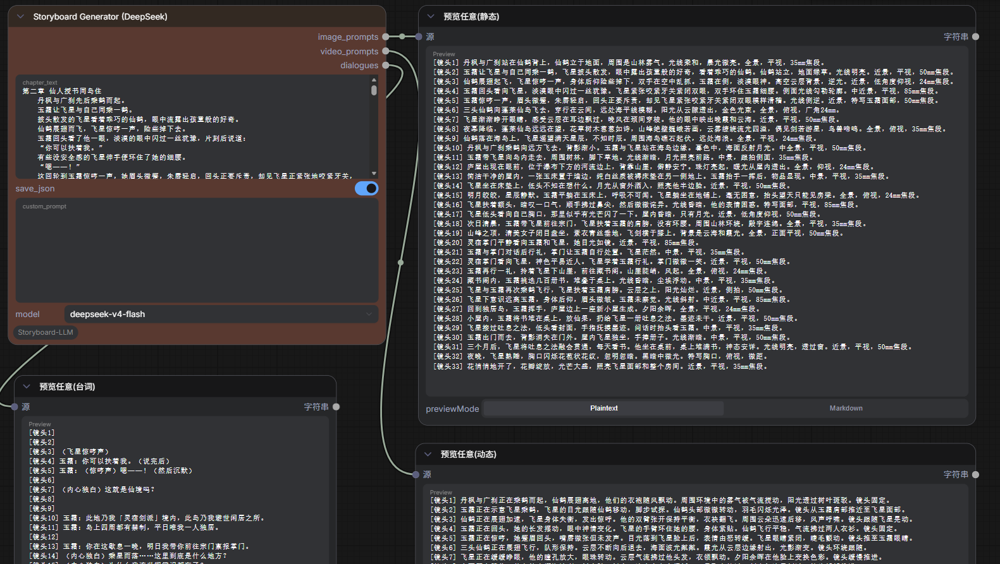

# ComfyUI-Storyboard-LLM

一个将小说章节转化为分镜表的 ComfyUI 插件，通过调用 DeepSeek API 生成静态图像提示词、动态视频提示词和台词。

## 功能特点

- 将小说章节文本转化为结构化的分镜表
- 每个分镜包含三部分输出：
  - 静态图像提示词（适合图像生成）
  - 动态视频提示词（适合视频生成）
  - 台词文本
- 支持保存分镜表为 JSON 文件
- 支持自定义提示词模板

## 节点预览



## 安装方法

1. 将 `ComfyUI-Storyboard-LLM` 文件夹复制到 ComfyUI 的 `custom_nodes` 目录
2. 安装依赖（如果尚未安装）：
```bash
pip install -r requirements.txt
```
3. 重启 ComfyUI

## 配置方法

编辑 `settings.json` 文件：

```json
{
  "api_key": "你的 DeepSeek API 密钥",
  "base_url": "https://api.deepseek.com",
  "output_path": ""
}
```

- `api_key`: 必需，你的 DeepSeek API 密钥
- `base_url`: 可选，API 基础 URL，默认为 `https://api.deepseek.com`
- `output_path`: 可选，JSON 文件保存路径，留空则保存到插件目录

## 使用方法

### 方法一：使用预设工作流（推荐）

1. 在 ComfyUI 中点击 `Load` 按钮
2. 选择 `workflows/Storyboard-Generator-Workflow(DeepSeek).json`
3. 在 `Storyboard Generator (DeepSeek)` 节点中输入小说章节文本
4. 运行工作流

### 方法二：手动搭建

1. 在 ComfyUI 中找到 `storyboard` 类别下的 `Storyboard Generator (DeepSeek)` 节点
2. 输入小说章节文本
3. 设置是否保存 JSON 文件
4. （可选）输入自定义提示词模板
5. 运行工作流

## 节点输入

| 输入项 | 类型 | 必填 | 说明 |
|--------|------|------|------|
| chapter_text | STRING | 是 | 小说章节内容 |
| save_json | BOOLEAN | 是 | 是否保存 JSON 文件 |
| custom_prompt | STRING | 否 | 自定义提示词模板 |

## 节点输出

| 输出项 | 类型 | 说明 |
|--------|------|------|
| image_prompts | STRING | 静态图像提示词，按镜头编号分组 |
| video_prompts | STRING | 动态视频提示词，按镜头编号分组 |
| dialogues | STRING | 台词文本，按镜头编号分组 |

## 输出格式示例

JSON 文件输出格式：
```json
[
    {
        "静态": "人物描述 + 动作 + 场景 + 光线 + 构图",
        "动态": "人物正在做什么，周围环境如何变化",
        "台词": "角色台词或内心独白"
    }
]
```

## 许可证

MIT License

## 注意事项

- 使用前请确保已获取 DeepSeek API 密钥
- API 调用会产生费用，请合理控制使用频率
- 建议每次输入一章节（中文字符为3000以下），过长文本可能导致响应截断
